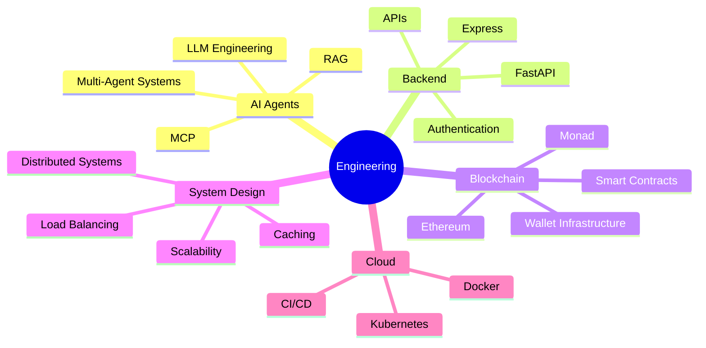

<!-- ========================================================= -->
<!--                   TOKYO NIGHT PROFILE                      -->
<!-- ========================================================= -->

<h1 align="center">
  Hi 👋, I'm <span style="color:#7aa2f7;">Anshul Kanswal</span>
</h1>

<p align="center">

<a href="https://git.io/typing-svg">
  
</a>
<br/>

</p>

<p align="center">


</p>

---

# 💫 About Me

```yaml
Name: Anshul Kanswal

Education:
  B.Tech CSE (Artificial Intelligence & Machine Learning)
  JSS University Noida
  Expected Graduation: 2028

Current Focus:
  • Backend Engineering
  • AI Agents
  • Distributed Systems
  • Blockchain Infrastructure
  • Production-grade APIs

Interests:
  • System Design
  • LLM Engineering
  • Open Source
  • Developer Experience
  • Cloud Native Applications
```

---

## 🚀 Professional Summary

I am a Computer Science undergraduate passionate about building scalable software systems, AI-powered applications, and decentralized infrastructure.

My work spans backend engineering, agentic AI, Web3 infrastructure, and developer tooling, with a strong focus on writing production-ready software that solves real-world problems.

Alongside engineering, I actively contribute to developer communities, mentor builders, organize technical events, and participate in national-level hackathons.

---

# 💼 Experience

| Role | Organization | Duration |
|------|--------------|----------|
| Developer Advocate | HackQuest | Present |
| Chief Mischief Officer | Builder Base | Present |
| Data Analytics Intern | AIHI Fusion Technologies × JSS University | Internship |
| IIT Bombay Techfest | North India Region Coordinator | Leadership |

---

# 🧠 Engineering Philosophy

> "Great software isn't just code that works—it's code that scales, remains maintainable, and creates lasting impact."

I enjoy solving engineering problems involving:

- Backend architecture
- AI infrastructure
- REST APIs
- Blockchain systems
- Developer tooling
- Automation
- Performance optimization

---

# 🛠 Engineering Stack

## 💻 Languages

<p>


</p>

---

## 🎨 Frontend

<p>


</p>

---

## ⚙ Backend

<p>


</p>

---

## 🗄 Databases

<p>


</p>

---

## ☁ DevOps & Tools

<p>


</p>

---

## ⛓ Blockchain

- Ethereum
- Monad
- EduChain
- Algorand
- BNB Chain
- Smart Contracts
- Ethers.js
- IPFS
- Pinata

---

## 🤖 AI

- FastAPI
- AI Agents
- Agentic AI
- LLM Workflows
- AI Automation
- AI-powered Applications

---

# 🌟 What I'm Working On

🚀 Agentic AI

⚡ Blockchain Infrastructure

🧠 MCP Integrations

🌐 Backend Systems

📦 REST APIs

🔐 Secure Wallet Integrations

🤖 Autonomous AI Agents

☁ Cloud-native Applications

---

# 📚 Currently Learning

- Kubernetes
- Distributed Systems
- Event-driven Architecture
- CQRS
- Event Sourcing
- Microservices
- RAG Systems
- Multi-Agent Systems
- High Performance Computing
- System Design

---

# 🌍 Connect With Me

<p align="center">

<a href="mailto:anshulkanswal01@gmail.com">

</a>

<a href="https://linkedin.com/in/anshul-kanswal">

</a>

<a href="https://github.com/anshulkanswal6-dev">

</a>

<a href="https://devanshulk01.vercel.app/">

</a>

<a href="https://leetcode.com/u/Anshulk01/">

</a>

<a href="https://x.com/AnshulKanswal01">

</a>

</p>

---

<!-- ========================================================= -->
<!--                    FEATURED PROJECTS                       -->
<!-- ========================================================= -->

# 🚀 Featured Projects

<table>

<tr>

<td width="50%">

## 🛡️ AEGIS

### AI-Powered Vibe Coding Platform for Autonomous On-Chain Agents

An intelligent developer platform that transforms natural language prompts into autonomous blockchain agents capable of executing secure on-chain operations within the Monad ecosystem.

### 🎯 Problem Solved

Traditional blockchain development requires developers to understand smart contracts, wallets, transaction flows, and blockchain infrastructure. AEGIS lowers this barrier by enabling AI-driven autonomous agent creation through natural language.

### 🏗 Architecture

```
User Prompt
      │
      ▼
LLM Processing
      │
      ▼
Agent Orchestrator
      │
      ▼
Wallet Manager
      │
      ▼
Monad Blockchain
```

### ⚙ Tech Stack

- React
- TypeScript
- Vite
- Node.js
- FastAPI
- Monad
- Solidity
- Ethers.js
- Wallet Integration

### ✨ Features

- Autonomous AI Agents
- Wallet Integration
- Smart Contract Execution
- Prompt-to-Agent Generation
- Transaction Automation
- Agent Task Scheduling
- Secure On-chain Execution

### 🚀 Engineering Highlights

- Modular Agent Architecture
- Secure Wallet Operations
- Production-oriented Backend Design
- Extensible AI Workflow
- Scalable Execution Pipeline

</td>

<td width="50%">

## 💳 Twin

### MCP-Powered Agentic Finance Layer

Twin acts as the execution infrastructure connecting AI agents with decentralized financial systems, enabling autonomous financial operations while preserving user custody.

### 🎯 Problem Solved

AI assistants currently lack secure financial execution capabilities. Twin bridges this gap through Agent Wallets, AI Sessions, and a ticket-based orchestration engine.

### 🏗 Architecture

```
Claude / Cursor
        │
        ▼
MCP Server
        │
        ▼
Ticket Engine
        │
        ▼
AI Session
        │
        ▼
Agent Wallet
        │
        ▼
Blockchain
```

### ⚙ Tech Stack

- FastAPI
- MCP
- Node.js
- Ethereum
- Stellar
- Solidity
- Wallet Infrastructure

### ✨ Features

- Agent Wallets
- AI Sessions
- Payment Automation
- Wallet Analytics
- Scheduled Transactions
- Natural Language Finance
- Secure Execution Layer

### 🔐 Security

- User Custody Preserved
- Session Isolation
- Permission Validation
- Ticket Verification
- Wallet Authentication
- Secure Execution Flow

### 🚀 Scalability

- Stateless APIs
- Modular Services
- Event-driven Tasks
- Queue-ready Architecture
- AI-native Infrastructure

</td>

</tr>

</table>

---

## ⛏ MineFind

### AI-based Cryptojacking Detection Platform

MineFind detects unauthorized cryptocurrency mining attacks by analyzing system behavior and identifying malicious resource utilization patterns.

### Key Features

- Threat Detection
- Behavioral Analysis
- CPU Usage Monitoring
- Process Inspection
- Security Alerts
- Dashboard Visualization

### Engineering Focus

- Machine Learning Classification
- Security Monitoring
- Resource Profiling
- Performance Analysis

---

# 🏆 Professional Highlights

| Category | Achievement |
|-----------|-------------|
| 🏆 Hackathons | Winner — CDAC Noida Hackathon |
| 🥈 Hackathons | Runner-Up — EduChain Delhi Regionals |
| 🌟 Community | Winner — HackQuest Co-Learning Camp 16 |
| 🚀 Leadership | IIT Bombay Techfest North India Region Coordinator |
| 👥 Community | Built and Scaled Builder Base Developer Community |
| 💻 Engineering | Multiple National & International Hackathon Finalist |
| 📢 Developer Relations | Developer Advocate at HackQuest |
| 📊 Industry | Data Analytics Intern (AIHI Fusion Technologies × JSS University) |

---

# 🏅 Competitive Programming

<div align="center">

| Platform | Profile |
|-----------|---------|
| 💛 LeetCode | https://leetcode.com/u/Anshulk01/ |

</div>

---

# 🥇 Leadership & Community

## 🚀 Developer Advocate — HackQuest

- Supported developer onboarding initiatives
- Promoted Web3 education
- Organized community events
- Assisted builders during hackathons
- Improved developer experience

---

## 🎯 Chief Mischief Officer — Builder Base

- Built and managed a thriving developer community
- Conducted workshops and technical sessions
- Led community engagement initiatives
- Fostered collaboration among student developers

---

## 🌏 IIT Bombay Techfest

### North India Region Coordinator

Responsibilities included:

- Managing regional outreach
- Coordinating technical events
- Building partnerships
- Student engagement
- Community expansion

---

# 📈 Engineering Capabilities

<table>

<tr>
<td>

✅ REST APIs

</td>

<td>

✅ Authentication & Authorization

</td>
</tr>

<tr>
<td>

✅ Backend Engineering

</td>

<td>

✅ Blockchain Development

</td>
</tr>

<tr>
<td>

✅ Smart Contracts

</td>

<td>

✅ AI Agent Workflows

</td>
</tr>

<tr>
<td>

✅ API Design

</td>

<td>

✅ Wallet Infrastructure

</td>
</tr>

<tr>
<td>

✅ Database Design

</td>

<td>

✅ Web3 Integrations

</td>
</tr>

<tr>
<td>

✅ Performance Optimization

</td>

<td>

✅ Distributed Systems (Learning)

</td>
</tr>

<tr>
<td>

✅ Production-grade Applications

</td>

<td>

✅ Open Source Collaboration

</td>
</tr>

</table>

---

# 📊 Engineering Focus Areas

```text
Backend Development        ████████████████████ 95%

AI Engineering             ██████████████████░ 90%

Blockchain                 █████████████████░░ 88%

Developer Advocacy         ██████████████████░ 90%

Frontend                   ███████████████░░░░ 78%

System Design              ████████████░░░░░░░ 65% (Learning)

Cloud Native               ██████████░░░░░░░░░ 55% (Learning)

Distributed Systems        █████████░░░░░░░░░░ 50% (Learning)
```

---

<div align="center">

### 💡 *"Build software that scales. Design systems that last. Create technology that empowers people."*

</div>

---

<!-- ========================================================= -->
<!--                    GITHUB METRICS                          -->
<!-- ========================================================= -->

# 📈 GitHub Analytics

<div align="center">


</div>

---

<div align="center">


</div>

---

# 📊 Contribution Graph

<div align="center">

[](https://github.com/ashutosh00710/github-readme-activity-graph)

</div>

---

# 🏆 GitHub Trophies

<div align="center">


</div>

---

# 📊 Profile Summary

<div align="center">


</div>

<br>

<div align="center">


</div>

<br>

<div align="center">


</div>

---

# ⚡ Development Activity

<div align="center">


</div>

> **Note:** The WakaTime card will display data only if you've connected your WakaTime account.

---

# 🐍 Contribution Snake

<div align="center">

<picture>

<source media="(prefers-color-scheme: dark)" srcset="https://raw.githubusercontent.com/anshulkanswal6-dev/anshulkanswal6-dev/output/github-contribution-grid-snake-dark.svg">

<source media="(prefers-color-scheme: light)" srcset="https://raw.githubusercontent.com/anshulkanswal6-dev/anshulkanswal6-dev/output/github-contribution-grid-snake.svg">


</picture>

</div>

---

# 📌 Professional Snapshot

<div align="center">

| 🚀 Focus | 💡 Expertise |
|-----------|-------------|
| Backend Engineering | REST APIs |
| AI Agents | LLM Workflows |
| Blockchain Infrastructure | Smart Contracts |
| FastAPI | Node.js |
| Developer Experience | Community Building |
| System Design | Currently Learning |
| Distributed Systems | Currently Learning |
| Cloud Native | Currently Learning |

</div>

---

# ⚙ Engineering Principles

```text
✔ Write maintainable code.

✔ Design scalable systems.

✔ Build secure software.

✔ Automate repetitive work.

✔ Learn continuously.

✔ Optimize before scaling.

✔ Measure everything.

✔ Document thoughtfully.

✔ Contribute to open source.

✔ Never stop building.
```

---

# 📚 Current Learning Roadmap



---

# 🌟 2026 Goals

- 🚀 Secure an SDE Internship
- 🏗 Build Production-Ready SaaS Products
- 🤖 Contribute to AI Agent Ecosystems
- ⛓ Build Infrastructure for Web3
- 🌍 Become a Consistent Open Source Contributor
- 📚 Master System Design Fundamentals
- ☁ Learn Kubernetes & Cloud-Native Development
- 🏆 Reach 500+ LeetCode Problems
- 💼 Land an International Software Engineering Opportunity

---

<div align="center">

### ⚡ "Code with purpose. Learn relentlessly. Build for impact."

</div>

---

<!-- ========================================================= -->
<!--                  CURRENTLY EXPLORING                      -->
<!-- ========================================================= -->

# 🌱 Currently Exploring

<div align="center">

| 🚀 Backend | 🤖 AI | ⛓️ Blockchain | ☁️ Cloud |
|:----------:|:-----:|:-------------:|:--------:|
| FastAPI | Agentic AI | Ethereum | Docker |
| Express.js | MCP | Monad | Kubernetes |
| GraphQL | RAG Systems | Stellar | CI/CD |
| gRPC | Multi-Agent Systems | Account Abstraction | AWS |
| Redis | AI Workflows | Smart Contracts | Cloud Native |

</div>

---

# 🧠 Engineering Interests

```text
Backend Architecture
██████████████████████████████ 100%

Artificial Intelligence
████████████████████████████ 95%

Blockchain Infrastructure
███████████████████████████ 92%

Developer Experience
█████████████████████████ 90%

Distributed Systems
██████████████████████ 80%

Cloud Native Engineering
████████████████████ 75%

System Design
██████████████████ 70%

Open Source
███████████████████████ 85%
```

---

# 🏅 Certifications & Learning

- 📘 Data Structures & Algorithms
- 📘 Object-Oriented Programming
- 📘 REST API Development
- 📘 Blockchain Development
- 📘 AI & Machine Learning Fundamentals
- 📘 FastAPI & Backend Engineering
- 📘 Database Design
- 📘 Software Engineering Best Practices

---

# 📌 Open Source Goals

- 🌍 Contribute to production-grade open-source projects
- 🚀 Build developer tools for AI & Web3
- 🛠️ Improve developer experience through automation
- 📚 Publish technical blogs and engineering write-ups
- 🤝 Collaborate with developers worldwide

---

# 🤝 Let's Connect

<div align="center">

<a href="mailto:anshulkanswal01@gmail.com">

</a>

<a href="https://www.linkedin.com/in/anshul-kanswal/">

</a>

<a href="https://github.com/anshulkanswal6-dev">

</a>

<a href="https://devanshulk01.vercel.app/">

</a>

<a href="https://leetcode.com/u/Anshulk01/">

</a>

<a href="https://x.com/AnshulKanswal01">

</a>

</div>

---

# 💼 Looking For

I'm always excited to collaborate on projects involving:

- 🚀 Backend Engineering
- 🤖 AI & Agentic AI
- 🧠 LLM Applications
- 🌐 Full-Stack Development
- ⛓️ Blockchain Infrastructure
- 📦 Open Source
- 🏆 Hackathons
- 💡 Startup Ideas

---

# 💬 Favorite Quote

<div align="center">

> **"The best engineers don't just solve today's problems—they design systems that make tomorrow's problems easier to solve."**

</div>

---

# ⚡ Fun Facts

- 🏆 Multiple National & International Hackathon Finalist
- 🎤 Passionate about Developer Advocacy
- 🌍 Love building communities
- 🧠 Constantly learning emerging technologies
- ☕ Fueled by curiosity, coffee, and clean code

---

# ❤️ Support My Work

If you find my projects useful, consider:

⭐ Starring my repositories

🍴 Contributing to my open-source projects

🤝 Connecting on LinkedIn

💬 Discussing ideas around AI, Backend, and Web3

---

<div align="center">


## Thanks for visiting! 👋

### ⭐ If you like my work, don't forget to follow me and star my repositories!


</div>

<!-- ========================================================= -->
<!--                        END README                         -->
<!-- ========================================================= -->
